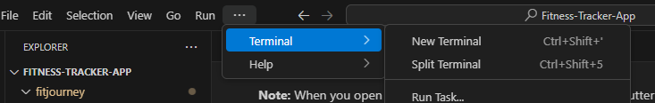

The project is provided in a top-level folder named:

**Fitness-Tracker-App/**

Inside this folder, the following items are included:

**README.md** - This file contains full setup instructions, running guidelines, test details, and troubleshooting steps.

**fitjourney/** - This is the main Flutter project folder, containing all the source code, assets, dependencies, and configuration files.

Key subfolders include:

**lib/** - main Dart source files where the app is developed.

**android/** - platform-specific configuration code.

**assets/** - image and resource files.

**test/** - Dart test files used for unit testing.

**pubspec.yaml** - defines app dependencies and assets.

**Instructions on how to run and install the product below:**

1. **Prerequisites**

To run this  project, ensure the following are installed:

Flutter SDK: Download and install from the official Flutter installation guide: https://docs.flutter.dev/get-started/install

Dart SDK: The Dart SDK is bundled with the Flutter SDK. No separate installation is required.​

Android SDK: Install via the official Android Studio download page: https://developer.android.com/studio

Visual Studio Code (VS Code): Download from the official Visual Studio Code website: https://code.visualstudio.com/Download

2. **Prepare Your Android Device**

To run the app on an Android device:

- **Enable Developer Options**
  - On your phone, go to `Settings > About phone`
  - Tap "**Build number**" 7 times until you see a message saying you're a developer.

- **Enable USB Debugging**
  - Go to `Settings > Developer options (May have to search for developer options once on settings)`
  - Enable **USB Debugging**

- **Connect Your Device via USB**
  - Plug in your device using a USB cable
  - Approve the "Allow USB debugging?" prompt (check "Always allow from this computer")

3. **Launch VS Code Studio**

Once everything is installed, launch VS Code Studio and select option **"Open Folder"**. Or you can go to **"File" > "Open Folder"**

4. **Locate project provided (ZIP file submitted on Moodle and extract)**

**Note:** When you open the project for the first time, VS Code and Flutter may take a few moments to configure everything. This includes indexing files, fetching dependencies, and syncing the Android build system (e.g., Gradle). Please be patient during this process, it may take upto 5-10 minutes first time.

5. **Navigate to the `fitjourney` folder in the terminal**

Once project is configured open the integrated terminal in VS Code to run the project commands.

You can do this by:
- Clicking the **three dots** in the top menu bar
- Navigating to **Terminal > New Terminal**

When the terminal opens, it will default to the root project folder (`Fitness-Tracker-App`).

To access the actual Flutter project, navigate into the `fitjourney` folder by typing:

**cd fitjourney**

This folder contains the source code and key configuration files for the Flutter project, such as lib/ and test/ and pubspec.yaml.

Then run the following:

**flutter pub get**

This reads the pubspec.yaml file and to make sure it fetches right version of dependencies listed for app to run.

6. **Run the Flutter project on the connected Android device**

Once you're inside the `fitjourney` folder in the terminal, and your Android device is connected with USB debugging enabled, run the following command:

**flutter run**

This command will build the app and launch it on your Android device. The process may take a few minutes the first time. You may be asked to select a device to run on if more than 1 is connected, just make sure to select device for the android being used and then app will build.
If everything is set up correctly, the app will automatically open on your phone.

**Potential TroubleShooting:**

If you encounter issues during setup or when trying to run the project, here are a few common problems and how to resolve them:

**Device Not Found:**

If you see an error like:

"No connected devices"
Make sure your Android device is properly set up and connected:

The USB cable is securely connected

Developer Options and USB Debugging are enabled

You’ve approved the USB debugging prompt on your phone (if asked)

If needed, go back to Step 2 and follow the instructions again.

You can also check if your device is recognized by running the following command in the terminal, inside the 'fitjourney' folder:

**flutter devices**

your device should appear in terminal if set up correctly.

**Gradle or SDK Errors:**

If you encounter a Gradle build error or something like:

"SDK location not found" 
or  
"Failed to install the following Android SDK packages..."
Try the following:

Read the Gradle error message — it usually includes a helpful link or hint about what SDK component is missing

Follow the link or instructions to install or update the required SDK packages

Make sure your Android SDK and build tools are properly installed (Step 1)

**How to run test cases**

Once project is open and configured, on the left-hand sidebar, click the Testing icon (flask symbol) as shown below:

In the testing panel that appears, click the "Run Tests" button to run all available test files as shown below:

# FitJourney
FitJourney is a mobile application designed to help users log workouts, track progress, and stay motivated with interactive data visualizations, goal tracking, and streak monitoring. Built using Flutter, it ensures a smooth and intuitive experience while leveraging Firebase for authentication and SQLite for local data storage.

Tech Stack
Frontend: Flutter (Dart)
Backend: Firebase Authentication
Database: SQLite (for local workout storage)
Data Visualization: fl_chart
