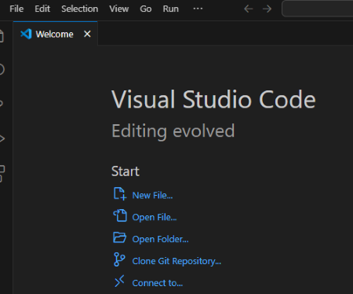

The project provided is in a top-level folder named:

**Fitness-Tracker-App**

Inside this folder, the following items are included:

**README.md** - This file contains full setup instructions, running guidelines, test details, and troubleshooting steps.

**fitjourney/** - This is the main Flutter project folder, containing all the source code, assets, dependencies, and configuration files.

Key subfolders include:

**fitjourney/lib/** - main Dart source files where the app is developed.

**fitjourney/android/** - platform specific configuration code.

**fitjourney/assets/** - image and resource files.

**fitjourney/test/** - Dart test files used for unit testing.

**fitjourney/pubspec.yaml** - defines app dependencies and assets.

**Instructions on how to run and install the product below:**

1. **Prerequisites**

To run this  project, ensure the following are installed:

Flutter SDK: Download and install from the official Flutter installation guide: https://docs.flutter.dev/get-started/install

Dart SDK: The Dart SDK is bundled with the Flutter SDK. No separate installation is required (Dart SDK version 3.7 was used for this project).​

Android SDK: Install via the official Android Studio download page: https://developer.android.com/studio

Visual Studio Code (VS Code): Download from the official Visual Studio Code website: https://code.visualstudio.com/Download

2. **Prepare Your Android Device**

To run the app on an Android device:

- **Enable Developer Options**
  - On your phone, go to `Settings > About phone`
  - Tap "**Build number**" 7 times until you see a message saying you're a developer.
  - On some devices, you might need to go to Software information to find the Build number.

- **Enable USB Debugging**
  - Go to `Settings > Developer options (May have to search for developer options once on settings)`
  - Scroll down to find and enable **USB Debugging**

- **Connect Your Device via USB**
  - Use a USB cable to connect your Android device to your computer.
  - Approve the "Allow USB debugging?" prompt (check "Always allow from this computer").

For detailed instructions, refer to the official Android documentation: https://developer.android.com/studio/debug/dev-options

3. **Launch VS Code Studio**

Once everything is installed, launch VS Studio COde and select option **"Open Folder"**. Or you can go to **"File" > "Open Folder"**.

4. **Open the provided project (extract the ZIP folder submitted on Moodle).**

Make sure to open the project from the top-level folder named **Fitness-Tracker-App.**

**Note:** When you open the project for the first time, VS Code and Flutter may take a few moments to configure everything. This includes indexing files, fetching dependencies, and syncing the Android build system (e.g., Gradle). Please be patient during this process, it may take upto 5-10 minutes first time.

5. **Navigate to the `fitjourney` folder in the terminal**

Once project is configured, open the integrated terminal in VS Code to run the project commands.

You can do this by:
- Clicking the **three dots** in the top menu bar
- Navigating to **Terminal > New Terminal**

When the terminal opens, it will default to the root project folder (`Fitness-Tracker-App`).

To access the actual Flutter project, navigate into the `fitjourney` folder by typing:

**cd fitjourney**

This folder contains the source code and key configuration files for the Flutter project, such as lib/ and test/ and pubspec.yaml.

Then run the following:

**flutter pub get**

This reads the pubspec.yaml file and to make sure it fetches right version of dependencies listed for app to run (May take upto a minute to run).

6. **Run the Flutter project on the connected Android device**

Once you're inside the `fitjourney` folder in the terminal, and your Android device is connected with USB debugging enabled, run the following command:

**flutter run**

This command will build the app and launch it on your Android device. The process may take a few minutes the first time. You may be asked to select a device to run on if more than 1 is connected, just make sure to select device for the android being used and then app will build.
If everything is set up correctly, the app will automatically open on your phone and you will be directed to the app's signup page.

**Potential Troubleshooting:**

If you encounter issues during setup or when trying to run the project, here are a few common problems and how to resolve them:

**Device Not Found:**

If you see an error like:

"No connected devices"
Make sure your Android device is properly set up and connected:

The USB cable is securely connected

Developer Options and USB Debugging are enabled

You’ve approved the USB debugging prompt on your phone (if asked)

If needed, go back to Step 2 and follow the instructions again.

You can also check if your device is recognised by running the following command in the terminal, inside the 'fitjourney' folder:

**flutter devices**

your device should appear in terminal if set up correctly.

**Gradle or SDK Errors:**

If you encounter a Gradle build error or something like:

"SDK location not found" 
or  
"Failed to install the following Android SDK packages..."
Try the following:

Read the Gradle error message - it usually includes a helpful link or hint about what SDK component is missing

Follow the link or instructions to install or update the required SDK packages

Make sure your Android SDK and build tools are properly installed (Step 1)

To double-check your environment setup, run:

**flutter doctor**

This command will highlight any missing dependencies or configuration issues. Ignore the Visual Studio warning - it’s only needed for Windows desktop apps, not Android.

Potential issues are further detailed in the Flutter installation help guide: https://docs.flutter.dev/get-started/install/help

**Guide on how to run test cases as well provided below:**

Once project is open and configured, on the left-hand sidebar, click the Testing icon (flask symbol) as shown below:

In the testing panel that appears, click the "Run Tests" button to run all available test files as shown below:

**Testing FitJourney App**

When first launching FitJourney, the app will have no workout data or goals in your local database. To fully experience and test the app's capabilities, you'll need to:
•	Log several workouts over different days
•	Create various types of goals
•	Use the app consistently to build streak data
This initial data population is essential to see the app's visualisation features, progress tracking, and statistical analysis in action.

**Signup Process:**
•	On the signup page, enter your email, first name, last name, and password
•	Tap "Sign Up" to create your account
•	Check your email and follow the verification link
•	Return to the app and click "I've verified my email"
•	Log in with your credentials

**Home Page**
•	View your current workout streak
•	Check today's activity status
•	See your most recent workout summary
•	Use the "Log Workout" button to record today's exercise
•	Alternatively, log a rest day to maintain your streak
•	Tap on your active goal to view detailed progress

**Workouts Page**
•	View your workout history organised by date
•	Filter workouts by body part (All, Upper Body, Lower Body)
•	Filter by time period (All Time, This Week, This Month, Last 3 Months)
•	Tap any workout to see detailed exercise and set information
•	Use the "+" button to log a new workout
•	Try the "Compare" button to analyse progress between two workouts

**Goals Page**
•	View your active fitness goals with progress indicators
•	See completed goals in a separate section
•	Tap "Create New Goal" to set up:
•	Weight goals
•	Strength goals for specific exercises
•	Workout frequency goals
•	Tap on any goal to see detailed progress information and history

**Progress Page**
Contains three tabs:
1.	Insights Tab:
•	View workout volume over time
•	See muscle group distribution chart
•	Check personal bests
2.	Exercise Tab:
•	Select any exercise to view strength progression
•	View weight progression chart over time
•	Check exercise history
3.	Calendar Tab:
•	View your workout calendar with streak information
•	Tap on dates to see what exercises were performed

**Profile Page**
•	Manually sync data to cloud
•	Log out from the app and delete account

Tech Stack
Frontend: Flutter (Dart)
Backend: Firebase Authentication, Firestore
Database: SQLite (for local workout storage)
Data Visualisation: fl_chart
